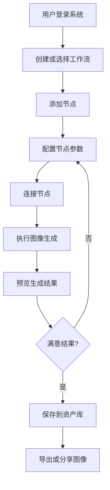
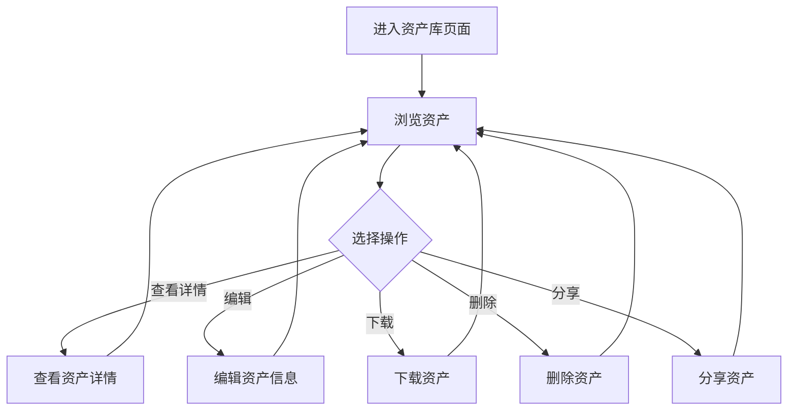
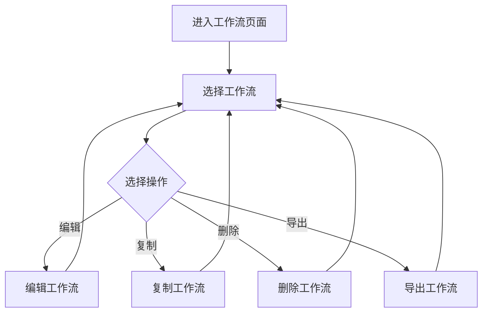
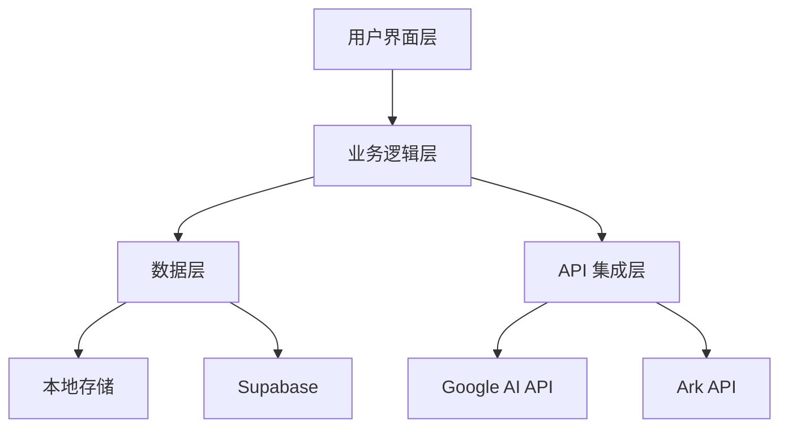

# 产品设计文档（PRD）

## 1. 产品概述

### 1.1 产品定位

本产品是一个基于 AI 技术的图像生成工作流平台，旨在为用户提供直观、高效的图像创作工具。通过节点式工作流编辑界面，用户可以灵活组合文本、图像等输入，利用多种 AI 模型生成高质量图像，并进行预览、管理和导出。

### 1.2 产品目标

- 提供直观的节点式工作流编辑界面，降低 AI 图像生成的使用门槛
- 支持多种 AI 模型，满足不同场景的图像生成需求
- 实现高效的资产管理，方便用户管理和复用生成的图像
- 提供丰富的参数配置选项，满足专业用户的定制化需求
- 确保稳定的系统性能和良好的用户体验

### 1.3 目标用户

- **设计师**：需要快速生成创意素材和设计参考
- **内容创作者**：需要为文章、视频等内容生成配图
- **营销人员**：需要为营销活动生成宣传图片
- **个人用户**：对 AI 图像生成感兴趣，希望尝试创作的普通用户
- **开发者**：希望集成 AI 图像生成功能到自己的应用中

### 1.4 产品价值

- **提高创作效率**：通过 AI 模型快速生成图像，节省传统设计的时间成本
- **降低创作门槛**：直观的节点式界面，无需专业设计技能即可使用
- **丰富创意可能性**：多种 AI 模型和参数配置，拓展创意边界
- **优化资产管理**：集中管理生成的图像，方便查找和复用

## 2. 核心功能需求

### 2.1 功能模块划分

| 模块名称 | 功能描述 |
|---------|----------|
| 工作流编辑 | 节点式工作流创建、编辑、管理 |
| 图像生成 | 多模型图像生成、参数配置 |
| 资产管理 | 生成图像的存储、分类、管理 |
| 预览展示 | 图像生成结果的实时预览 |
| API 集成 | Google AI、Ark API、Supabase 集成 |
| 用户设置 | API Key 配置、系统设置 |

### 2.2 详细功能需求

#### 2.2.1 工作流编辑模块

| 功能点 | 描述 | 优先级 |
|--------|------|--------|
| 工作流创建 | 支持创建新的工作流，自动生成唯一标识 | 高 |
| 工作流管理 | 支持工作流的重命名、删除、切换 | 高 |
| 节点添加 | 支持通过拖拽或点击添加不同类型的节点 | 高 |
| 节点连接 | 支持节点间的连接，定义数据流向 | 高 |
| 节点编辑 | 支持编辑节点属性和参数 | 高 |
| 节点删除 | 支持删除不需要的节点 | 高 |
| 节点移动 | 支持拖拽调整节点位置 | 中 |
| 工作流导入导出 | 支持工作流的导入和导出，方便分享和备份 | 中 |

#### 2.2.2 图像生成模块

| 功能点 | 描述 | 优先级 |
|--------|------|--------|
| 多模型支持 | 支持 Google Gemini、Imagen、Doubao Seedream 等模型 | 高 |
| 模型切换 | 支持在不同模型间切换，适应不同场景需求 | 高 |
| 提示词输入 | 支持文本提示词输入，控制图像生成方向 | 高 |
| 图像输入 | 支持上传参考图像，影响生成结果 | 高 |
| 参数配置 | 支持配置宽高比、质量、创意度等参数 | 高 |
| 批量生成 | 支持一次生成多张图像 | 中 |
| 生成历史 | 记录生成历史，方便查看和比较 | 中 |
| 错误处理 | 提供友好的错误提示和处理机制 | 高 |

#### 2.2.3 资产管理模块

| 功能点 | 描述 | 优先级 |
|--------|------|--------|
| 资产存储 | 自动保存生成的图像到资产库 | 高 |
| 资产浏览 | 支持按时间、类型等方式浏览资产 | 高 |
| 资产搜索 | 支持通过关键词搜索资产 | 中 |
| 资产分类 | 支持对资产进行标签分类 | 中 |
| 资产收藏 | 支持收藏常用资产 | 中 |
| 资产导出 | 支持下载和导出资产 | 高 |
| 资产删除 | 支持删除不需要的资产 | 中 |

#### 2.2.4 预览展示模块

| 功能点 | 描述 | 优先级 |
|--------|------|--------|
| 实时预览 | 实时预览生成的图像结果 | 高 |
| 图像放大 | 支持点击放大查看图像细节 | 中 |
| 图像对比 | 支持对比不同生成结果 | 中 |
| 预览控制 | 支持预览图像的缩放、旋转等操作 | 低 |

#### 2.2.5 API 集成模块

| 功能点 | 描述 | 优先级 |
|--------|------|--------|
| API Key 配置 | 支持配置 Google AI 和 Ark API 的 API Key | 高 |
| API 调用管理 | 管理 API 调用次数和配额 | 中 |
| API 错误处理 | 处理 API 调用失败的情况 | 高 |
| Supabase 集成 | 集成 Supabase 用于资产存储 | 中 |

#### 2.2.6 用户设置模块

| 功能点 | 描述 | 优先级 |
|--------|------|--------|
| 系统设置 | 支持配置系统语言、主题等 | 低 |
| 通知设置 | 支持配置通知方式和频率 | 低 |
| 缓存管理 | 支持清理缓存数据 | 低 |

## 3. 非功能需求

### 3.1 性能需求

| 需求点 | 描述 | 优先级 |
|--------|------|--------|
| 响应速度 | 页面加载时间 < 3 秒，操作响应时间 < 0.5 秒 | 高 |
| 生成速度 | 图像生成速度取决于模型和参数，但系统应提供进度反馈 | 中 |
| 并发处理 | 支持同时处理多个工作流，但资源使用应合理 | 中 |
| 内存使用 | 合理使用浏览器内存，避免内存泄漏 | 高 |

### 3.2 可用性需求

| 需求点 | 描述 | 优先级 |
|--------|------|--------|
| 界面友好性 | 界面设计简洁直观，操作流程清晰 | 高 |
| 错误提示 | 提供清晰、友好的错误提示信息 | 高 |
| 帮助文档 | 提供详细的使用指南和帮助文档 | 中 |
| 容错性 | 系统应能够处理用户的误操作，提供撤销功能 | 中 |

### 3.3 可靠性需求

| 需求点 | 描述 | 优先级 |
|--------|------|--------|
| 数据持久化 | 工作流和设置应自动保存到本地存储 | 高 |
| 错误恢复 | 系统崩溃后能够恢复到之前的状态 | 中 |
| API 重试 | 对网络错误和速率限制错误提供自动重试机制 | 高 |
| 稳定性 | 系统应稳定运行，避免频繁崩溃 | 高 |

### 3.4 安全性需求

| 需求点 | 描述 | 优先级 |
|--------|------|--------|
| API Key 保护 | API Key 应安全存储，避免明文暴露 | 高 |
| 网络安全 | 所有网络请求应使用 HTTPS 协议 | 高 |
| 内容安全 | 系统应遵守相关内容政策，避免生成违规内容 | 中 |

### 3.5 兼容性需求

| 需求点 | 描述 | 优先级 |
|--------|------|--------|
| 浏览器兼容 | 支持主流浏览器，包括 Chrome、Firefox、Safari、Edge | 高 |
| 响应式设计 | 支持不同屏幕尺寸，包括桌面和平板设备 | 中 |
| 系统兼容 | 支持 Windows、macOS、Linux 等操作系统 | 高 |

## 4. 用户流程图

### 4.1 主要用户流程

**流程名称：图像生成流程**



**流程名称：资产管理流程**



**流程名称：工作流管理流程**



## 5. 详细信息架构

### 5.1 整体架构



### 5.2 页面结构

| 页面名称 | 模块名称 | 功能描述 |
|---------|---------|----------|
| 首页 | 工作流列表 | 展示和管理工作流 |
| 首页 | 创建按钮 | 创建新工作流 |
| 工作流编辑页 | 画布区域 | 工作流节点编辑 |
| 工作流编辑页 | 节点工具栏 | 节点类型选择 |
| 工作流编辑页 | 节点详情面板 | 节点参数配置 |
| 工作流编辑页 | 顶部导航 | 工作流管理操作 |
| 工作流编辑页 | 底部工具栏 | 常用工具操作 |
| 资产库页 | 资产列表 | 生成图像展示 |
| 资产库页 | 筛选工具 | 资产分类筛选 |
| 资产库页 | 操作工具栏 | 资产批量操作 |
| 设置页 | API 配置 | API Key 管理 |
| 设置页 | 系统设置 | 系统参数配置 |
| 灵感页 | 示例展示 | 提供生成灵感 |

### 5.3 数据结构

#### 5.3.1 工作流数据结构

```typescript
interface Workflow {
  id: string;
  name: string;
  nodes: Node[];
  edges: Edge[];
  createdAt: string;
  updatedAt: string;
}

interface Node {
  id: string;
  type: string; // 'image-input', 'text-input', 'image-editor', 'preview', 'character', 'processing'
  position: { x: number; y: number };
  data: Record<string, any>;
  width?: number;
  height?: number;
}

interface Edge {
  id: string;
  source: string;
  target: string;
  sourceHandle?: string;
  targetHandle?: string;
}
```

#### 5.3.2 资产数据结构

```typescript
interface Asset {
  id: string;
  type: 'image';
  title: string;
  description?: string;
  tags: string[];
  prompt: string;
  images: string[]; // 图像 URL 或 base64
  model: string;
  parameters: Record<string, any>;
  isFavorite: boolean;
  createdAt: string;
  updatedAt: string;
}
```

#### 5.3.3 用户设置数据结构

```typescript
interface UserSettings {
  apiKeys: {
    google: string;
    ark: string;
  };
  preferences: {
    language: string;
    theme: 'light' | 'dark';
    notifications: boolean;
  };
}
```

## 6. 各页面功能点及功能用例

### 6.1 首页

| 功能点 | 描述 | 功能用例 |
|--------|------|----------|
| 工作流列表 | 展示所有工作流 | 用户可以查看所有已创建的工作流，按时间排序 |
| 创建工作流按钮 | 创建新工作流 | 用户点击按钮后，系统创建一个新的空白工作流并跳转到编辑页面 |
| 工作流卡片 | 显示工作流信息 | 用户可以查看工作流名称、创建时间等信息，点击卡片进入编辑页面 |
| 工作流操作 | 编辑、复制、删除工作流 | 用户可以对工作流进行管理操作，删除时需要确认 |

### 6.2 工作流编辑页

| 功能点 | 描述 | 功能用例 |
|--------|------|----------|
| 画布区域 | 工作流编辑主区域 | 用户可以在画布上添加、移动、连接节点 |
| 节点工具栏 | 节点类型选择 | 用户可以从工具栏中选择不同类型的节点添加到画布 |
| 节点详情面板 | 节点参数配置 | 选中节点后，面板显示该节点的详细参数，用户可以进行配置 |
| 顶部导航 | 工作流管理 | 提供工作流重命名、保存、导出等操作 |
| 底部工具栏 | 常用工具 | 提供撤销、重做、缩放等常用操作工具 |
| 执行按钮 | 执行工作流 | 用户点击后，系统执行工作流中的图像生成操作 |

### 6.3 资产库页

| 功能点 | 描述 | 功能用例 |
|--------|------|----------|
| 资产列表 | 展示生成的图像 | 用户可以浏览所有生成的图像，按时间倒序排列 |
| 筛选工具 | 资产分类筛选 | 用户可以按模型、标签、时间等条件筛选资产 |
| 搜索框 | 资产搜索 | 用户可以通过关键词搜索资产 |
| 资产卡片 | 资产信息展示 | 显示图像预览、提示词、模型等信息 |
| 资产操作 | 下载、分享、删除 | 用户可以对资产进行各种操作 |
| 批量操作 | 批量管理资产 | 用户可以选择多个资产进行批量操作 |

### 6.4 设置页

| 功能点 | 描述 | 功能用例 |
|--------|------|----------|
| API Key 配置 | 配置 API Key | 用户可以输入和保存 Google AI 和 Ark API 的 API Key |
| 系统设置 | 配置系统参数 | 用户可以配置语言、主题等系统参数 |
| 缓存管理 | 管理缓存 | 用户可以查看和清理缓存数据 |
| 关于页面 | 显示系统信息 | 显示系统版本、更新日志等信息 |

### 6.5 灵感页

| 功能点 | 描述 | 功能用例 |
|--------|------|----------|
| 示例展示 | 展示生成示例 | 展示各种风格和类型的生成示例，提供灵感 |
| 提示词库 | 常用提示词 | 提供常用的提示词模板，用户可以直接使用 |
| 趋势展示 | 热门生成趋势 | 展示当前热门的生成主题和风格 |

## 7. 各模块组件分类及交互上下游

### 7.1 工作流编辑模块

| 组件名称 | 类型 | 交互上游 | 交互下游 | 功能描述 |
|---------|------|----------|----------|----------|
| WorkflowTab | 容器组件 | App.tsx | WorkflowContext | 工作流标签管理 |
| FloraCanvas | 容器组件 | WorkflowTab | NodeContext | 流程图画布 |
| AddNodeButton | 功能组件 | FloraCanvas | NodeTypeMenu | 添加节点按钮 |
| NodeTypeMenu | 功能组件 | AddNodeButton | NodeContext | 节点类型选择菜单 |
| NodeToolbar | 功能组件 | ImageEditorNode | NodeContext | 节点工具栏 |
| DeletableEdge | 功能组件 | FloraCanvas | EdgeContext | 可删除的边 |
| SimpleEdge | 功能组件 | FloraCanvas | EdgeContext | 简单边 |

### 7.2 图像生成模块

| 组件名称 | 类型 | 交互上游 | 交互下游 | 功能描述 |
|---------|------|----------|----------|----------|
| ImageEditorNode | 容器组件 | FloraCanvas | googleAI.ts | 图像编辑节点 |
| ImageEditorInput | 功能组件 | ImageEditorNode | ImageEditorService | 图像编辑器输入 |
| ImageEditorService | 服务组件 | ImageEditorInput | googleAI.ts | 图像编辑服务 |
| ImageInputNode | 功能组件 | FloraCanvas | ImageEditorNode | 图像输入节点 |
| TextInputNode | 功能组件 | FloraCanvas | ImageEditorNode | 文本输入节点 |
| CharacterNode | 功能组件 | FloraCanvas | ImageEditorNode | 角色节点 |
| ProcessingNode | 功能组件 | FloraCanvas | ImageEditorNode | 处理节点 |

### 7.3 资产管理模块

| 组件名称 | 类型 | 交互上游 | 交互下游 | 功能描述 |
|---------|------|----------|----------|----------|
| AssetsPage | 容器组件 | App.tsx | AssetsContext | 资产库页面 |
| AssetsContext | 上下文组件 | App.tsx | AssetsPage | 资产库状态管理 |
| CharacterSelectionList | 功能组件 | AssetsPage | CharacterNode | 角色选择列表 |
| NewCharacterSelectionList | 功能组件 | AssetsPage | CharacterNode | 新角色选择列表 |

### 7.4 预览展示模块

| 组件名称 | 类型 | 交互上游 | 交互下游 | 功能描述 |
|---------|------|----------|----------|----------|
| PreviewNode | 功能组件 | FloraCanvas | ImageEditorNode | 预览节点 |
| ImageWithFallback | 功能组件 | figma | 通用 | 带回退的图像组件 |

### 7.5 API 集成模块

| 组件名称 | 类型 | 交互上游 | 交互下游 | 功能描述 |
|---------|------|----------|----------|----------|
| ApiKeyDialog | 功能组件 | Header | 本地存储 | API Key 配置对话框 |
| googleAI.ts | 服务组件 | ImageEditorService | Google AI API | Google AI 和 Ark API 集成 |

### 7.6 用户界面模块

| 组件名称 | 类型 | 交互上游 | 交互下游 | 功能描述 |
|---------|------|----------|----------|----------|
| Header | 容器组件 | App.tsx | 通用 | 头部导航 |
| BottomToolbar | 功能组件 | App.tsx | 通用 | 底部工具栏 |
| NavigationToolbar | 功能组件 | App.tsx | 通用 | 导航工具栏 |
| NodeDetailPanel | 功能组件 | FloraCanvas | NodeContext | 节点详情面板 |
| CanvasContextMenu | 功能组件 | FloraCanvas | NodeContext | 画布上下文菜单 |

## 8. 关键模块细节

### 8.1 图像生成模块

#### 8.1.1 核心流程

1. **参数收集**：从用户输入和连接的节点中收集生成参数
2. **模型选择**：根据用户选择的模型确定调用的 API
3. **API 调用**：构建请求并调用相应的 API
4. **结果处理**：处理 API 返回的结果，转换为可展示的格式
5. **错误处理**：捕获和处理 API 调用过程中的错误
6. **结果存储**：将生成的图像保存到资产库

#### 8.1.2 技术实现

- 使用 Google AI SDK 调用 Google 模型
- 使用 HTTP 请求调用 Ark API
- 实现指数退避重试策略处理速率限制
- 使用 base64 编码处理返回的图像数据
- 使用 localStorage 缓存生成结果

### 8.2 工作流编辑模块

#### 8.2.1 核心流程

1. **工作流加载**：从本地存储加载工作流数据
2. **节点渲染**：根据工作流数据渲染节点和边
3. **用户交互**：处理用户的拖拽、点击等操作
4. **数据更新**：实时更新工作流数据
5. **自动保存**：定期自动保存工作流状态

#### 8.2.2 技术实现

- 使用 @xyflow/react 库实现节点式工作流编辑
- 使用 React Context API 管理工作流状态
- 使用 localStorage 持久化工作流数据
- 使用 GSAP 实现节点动画效果

### 8.3 资产管理模块

#### 8.3.1 核心流程

1. **资产存储**：将生成的图像保存到资产库
2. **资产检索**：根据条件查询和筛选资产
3. **资产操作**：处理资产的下载、分享、删除等操作
4. **资产同步**：与 Supabase 同步资产数据

#### 8.3.2 技术实现

- 使用 localStorage 存储资产元数据
- 使用 Supabase 存储图像文件
- 实现资产标签系统
- 实现资产搜索和筛选功能

### 8.4 API 集成模块

#### 8.4.1 核心流程

1. **API Key 管理**：安全存储和管理 API Key
2. **API 请求构建**：根据模型和参数构建 API 请求
3. **API 调用执行**：发送请求并处理响应
4. **错误处理**：处理 API 错误和异常情况
5. **配额管理**：跟踪和管理 API 调用配额

#### 8.4.2 技术实现

- 使用 localStorage 安全存储 API Key
- 实现 API 请求的超时和重试机制
- 实现 API 调用的队列管理
- 提供 API 调用状态的实时反馈

## 9. 产品验收标准

### 9.1 功能验收

| 功能点 | 验收标准 |
|--------|----------|
| 工作流创建和编辑 | 能够成功创建、编辑、保存工作流 |
| 节点添加和连接 | 能够添加不同类型的节点并正确连接 |
| 图像生成 | 能够使用不同模型成功生成图像 |
| 资产管理 | 能够查看、下载、删除生成的图像 |
| API Key 配置 | 能够成功配置和使用 API Key |
| 错误处理 | 系统能够正确处理错误并提供友好提示 |

### 9.2 性能验收

| 测试项 | 验收标准 |
|--------|----------|
| 页面加载时间 | 首页加载时间 < 3 秒 |
| 操作响应时间 | 按钮点击响应时间 < 0.5 秒 |
| 图像生成时间 | 简单图像生成时间 < 30 秒 |
| 系统稳定性 | 连续操作 1 小时无崩溃 |

### 9.3 兼容性验收

| 测试项 | 验收标准 |
|--------|----------|
| 浏览器兼容 | 在 Chrome、Firefox、Safari、Edge 中正常运行 |
| 操作系统兼容 | 在 Windows、macOS、Linux 中正常运行 |
| 响应式设计 | 在不同屏幕尺寸下正常显示 |

### 9.4 安全性验收

| 测试项 | 验收标准 |
|--------|----------|
| API Key 安全 | API Key 安全存储，不明文暴露 |
| 网络安全 | 所有网络请求使用 HTTPS |
| 内容安全 | 系统能够识别和处理违规内容 |

## 10. 附录

### 10.1 术语定义

| 术语 | 解释 |
|------|------|
| 工作流 | 由节点和边组成的可视化流程，用于定义图像生成的步骤 |
| 节点 | 工作流中的基本单元，代表一个功能模块，如文本输入、图像生成等 |
| 边 | 连接节点的线条，定义数据的流向 |
| 提示词 | 用于指导 AI 模型生成图像的文本描述 |
| API Key | 用于访问 API 的身份验证密钥 |
| 资产 | 生成的图像及其相关元数据 |
| 模型 | AI 图像生成的算法模型，如 Gemini、Imagen 等 |

### 10.2 参考资源

- [Google AI SDK 文档](https://ai.google.dev/docs)
- [Ark API 文档](https://www.volcengine.com/docs/ark)
- [Supabase 文档](https://supabase.com/docs)
- [@xyflow/react 文档](https://xyflow.com/docs)
- [React 文档](https://react.dev/)
- [TypeScript 文档](https://www.typescriptlang.org/)

### 10.3 版本历史

| 版本 | 日期 | 主要变更 |
|------|------|----------|
| 1.0.0 | 2026-02-11 | 初始版本 |
